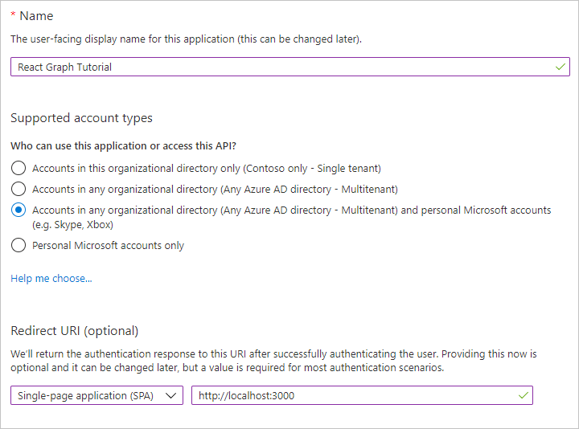

<!-- markdownlint-disable MD002 MD041 -->

In this exercise, you will create a new Azure AD web application registration using the Azure Active Directory admin center.

1. Open a browser and navigate to the [Azure Active Directory admin center](https://aad.portal.azure.com). Login using a **personal account** (aka: Microsoft Account) or **Work or School Account**.

1. Select **Azure Active Directory** in the left-hand navigation, then select **App registrations** under **Manage**.

    

    > [!NOTE]
    > Azure AD B2C users may only see **App registrations (legacy)**. In this case, please go directly to [https://aka.ms/appregistrations](https://aka.ms/appregistrations).

1. Select **New registration**. On the **Register an application** page, set the values as follows.

    - Set **Name** to `React Graph Tutorial`.
    - Set **Supported account types** to **Accounts in any organizational directory and personal Microsoft accounts**.
    - Under **Redirect URI**, set the first drop-down to `Web` and set the value to `http://localhost:3000`.

    

1. Choose **Register**. On the **React Graph Tutorial** page, copy the value of the **Application (client) ID** and save it, you will need it in the next step.

    

1. Select **Authentication** under **Manage**. Locate the **Implicit grant** section and enable **Access tokens** and **ID tokens**. Choose **Save**.

    
